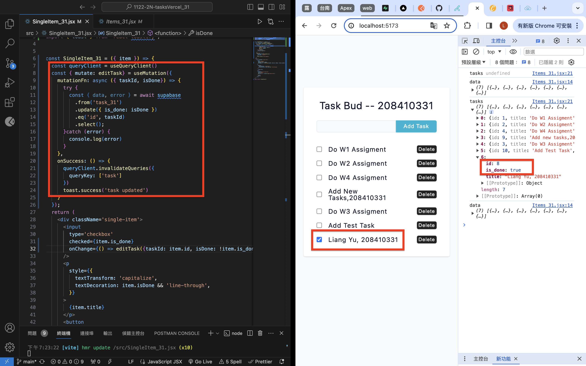
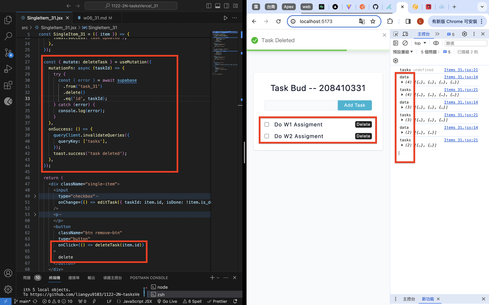
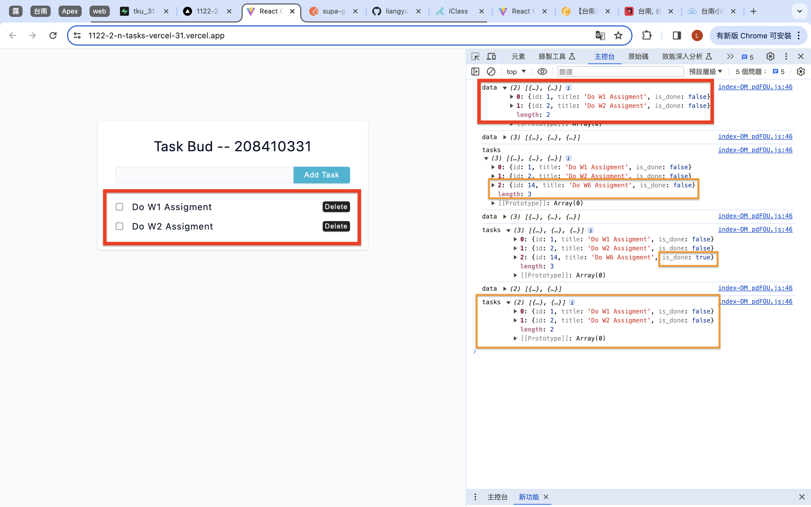
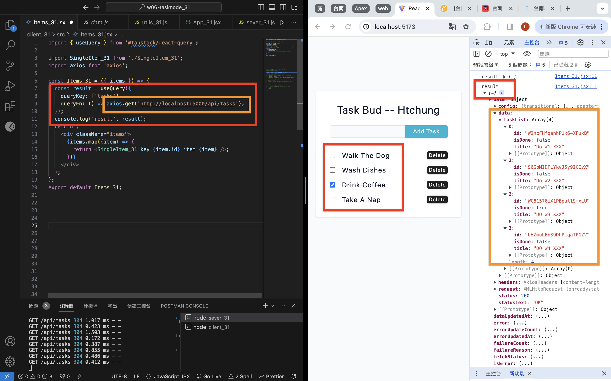
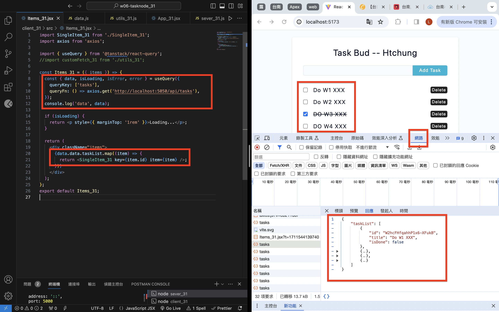

[Github](https://github.com/liangyu9103/1122-wp2-2N_31.git)
[Vercal](https://1122-2-n-tasks-vercel-31.vercel.app/)

### W6-P1: Update a task in Supabase



```
6cb7eb3 陳亮瑜  Wed Mar 27 19:36:47 2024 +0800  ### W6-P1: Update a task in Supabase
```

### W6-P2: Delete a task in Supabase

#### => local



#### => Vercel: insert a task, edit the task, delete the task



```

```

### W6-P3: Get all tasks from node server





```

```

```
"git log --pretty=format:"%h%x09%an%x09%ad%x09%s" --after="2024-03-25"
```
