[Github](https://github.com/liangyu9103/1122-wp2-2N_31.git)

### W1-P1: Get Request demo in Postman

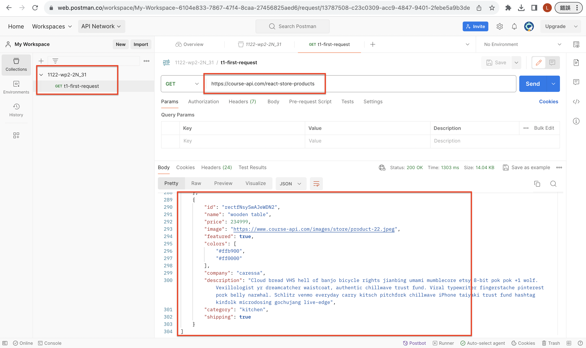

```
99ecc61 陳亮瑜  Wed Feb 21 19:22:41 2024 +0800  ### w1-P1: Get Request demo in Postman:
```

### W1-P2: read card_31 table in Supabase

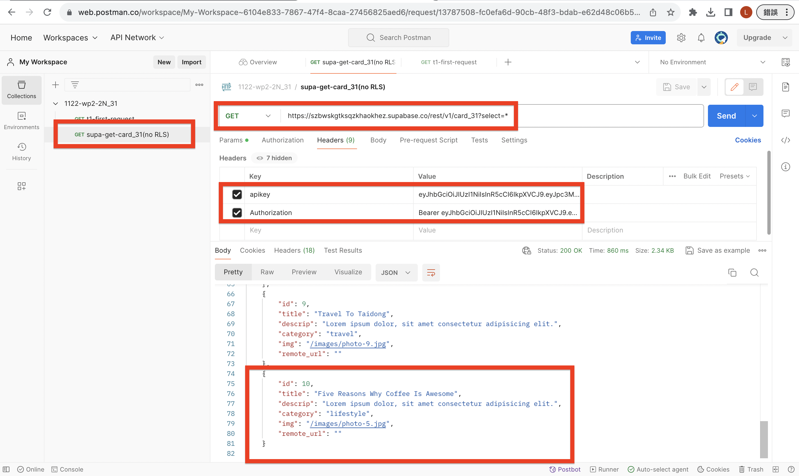

```
39a865f 陳亮瑜  Wed Feb 21 19:52:32 2024 +0800  ### W1-P2 read card_31 table in Supabase:
```

### W1-P3: Create a card into card_31 table in Supabase

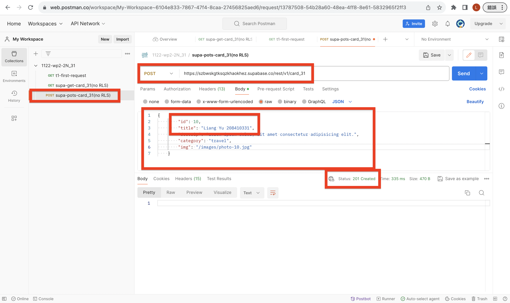
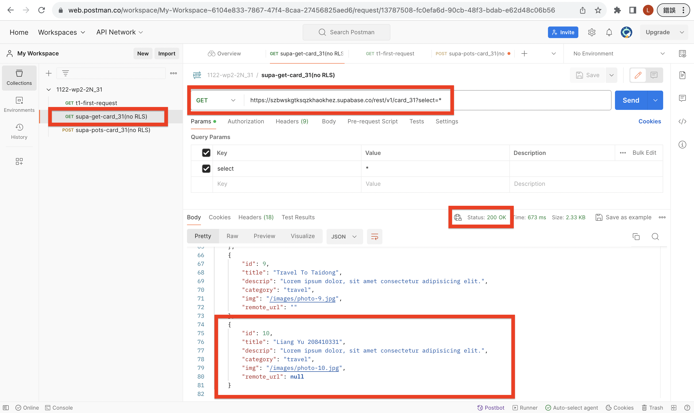

```
07f1a32 陳亮瑜  Wed Feb 21 20:23:26 2024 +0800  ### W1-P3: Create a card into card_31 table in Supabase
```

### W1-P4: Update a card in Supabase using remote photo

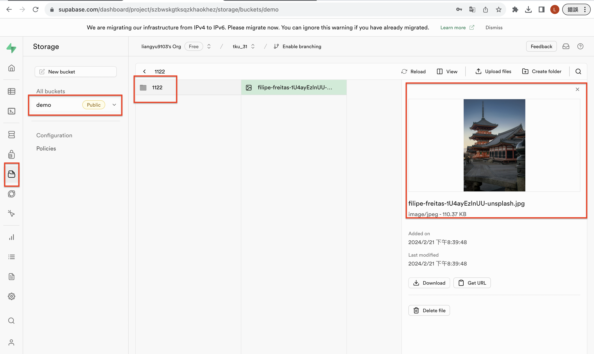
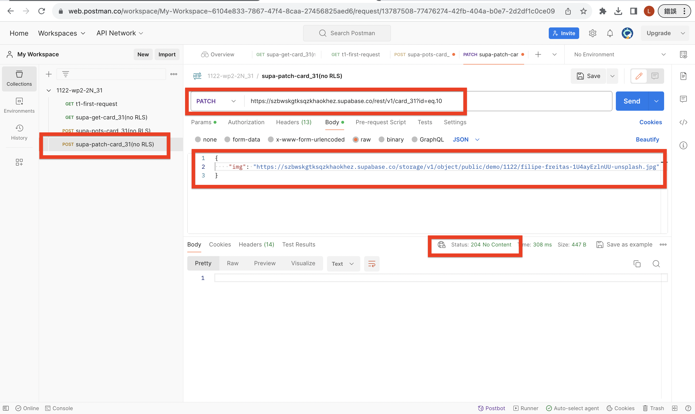
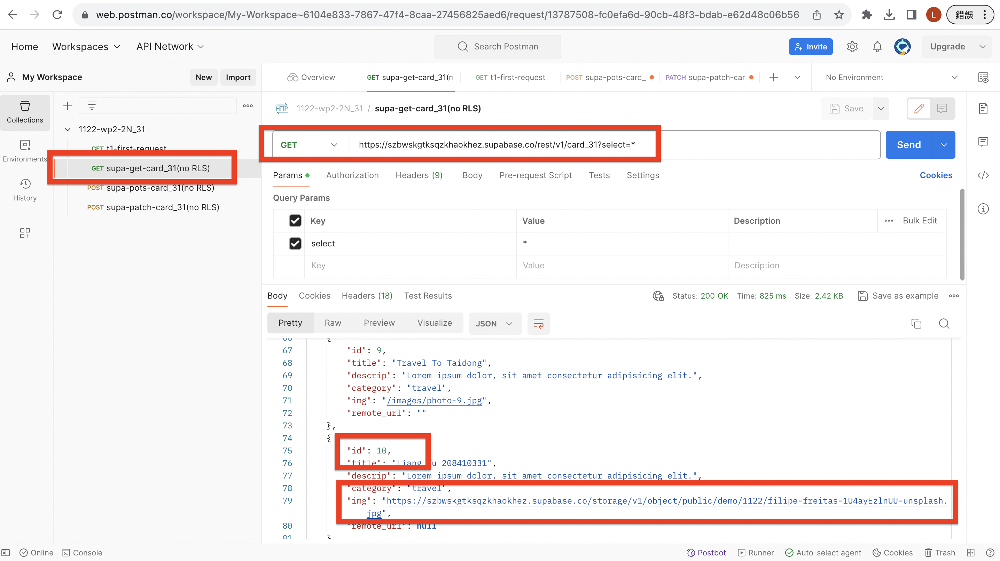

```
cd7151e 陳亮瑜  Wed Feb 21 20:55:50 2024 +0800  ### W1-P4: Update a card in Supabase using remote photo
```

### W1-P5:Delete a card in Supabase

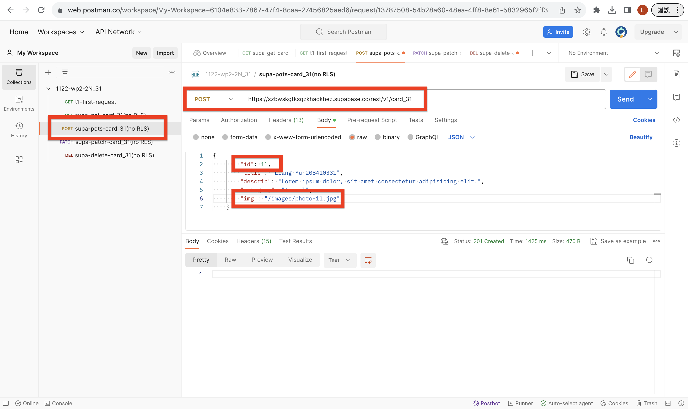
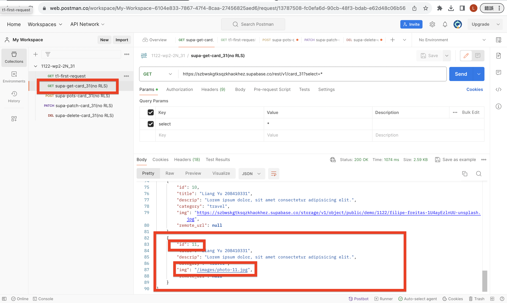
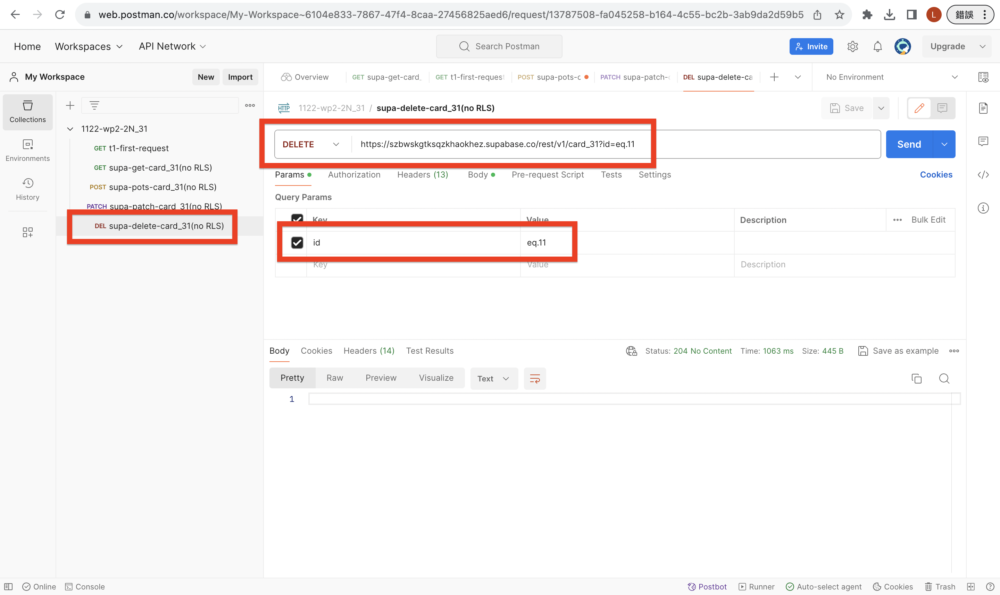
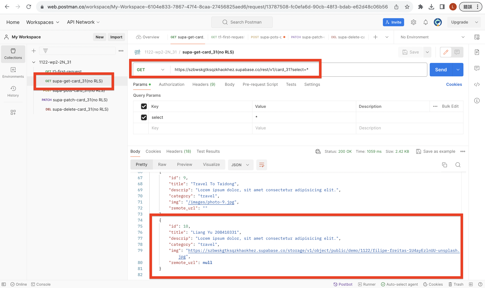

```
9ae0ac3 陳亮瑜  Wed Feb 21 21:12:18 2024 +0800  ### W1-P5:Delete a card in Supabase
```

### W1-P6: Git log of W1

```
git log --pretty=format:"%h%x09%an%x09%ad%x09%s" --after="2024-02-20"

3f01490 陳亮瑜  Wed Feb 21 21:13:28 2024 +0800  ### W1-P6: Git log of W1
9ae0ac3 陳亮瑜  Wed Feb 21 21:12:18 2024 +0800  ### W1-P5:Delete a card in Supabase
cd7151e 陳亮瑜  Wed Feb 21 20:55:50 2024 +0800  ### W1-P4: Update a card in Supabase using remote photo
07f1a32 陳亮瑜  Wed Feb 21 20:23:26 2024 +0800  ### W1-P3: Create a card into card_31 table in Supabase
39a865f 陳亮瑜  Wed Feb 21 19:52:32 2024 +0800  ### W1-P2 read card_31 table in Supabase:
99ecc61 陳亮瑜  Wed Feb 21 19:22:41 2024 +0800  ### w1-P1: Get Request demo in Postman:
a50d5a4 陳亮瑜  Wed Feb 21 18:45:57 2024 +0800  1122-wp2-2N_31

```
