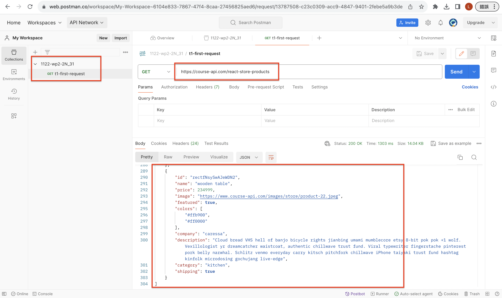
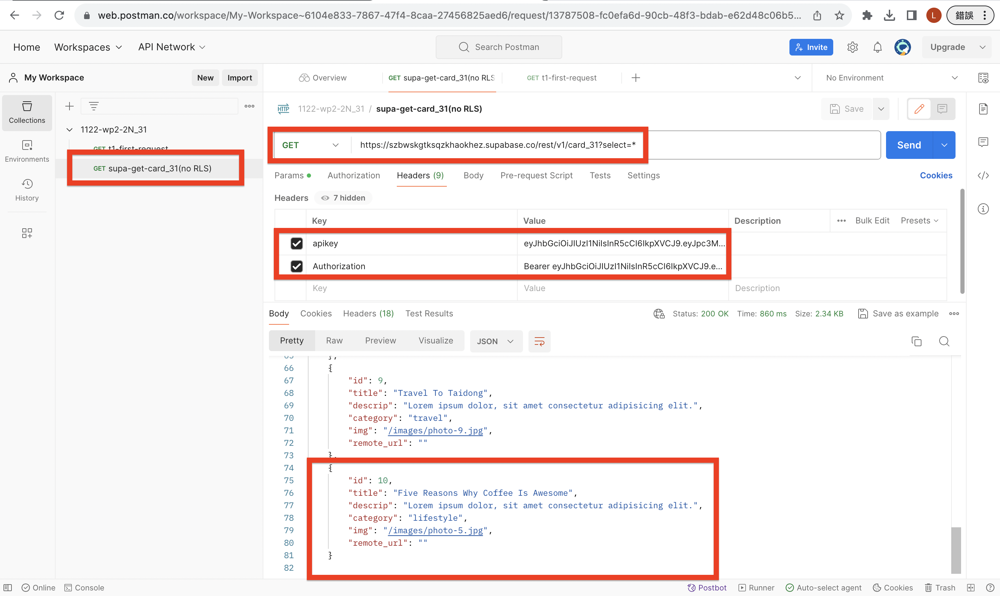
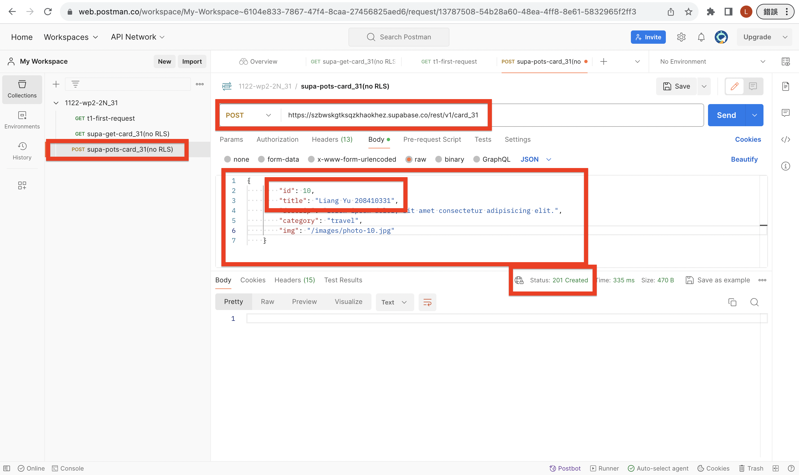
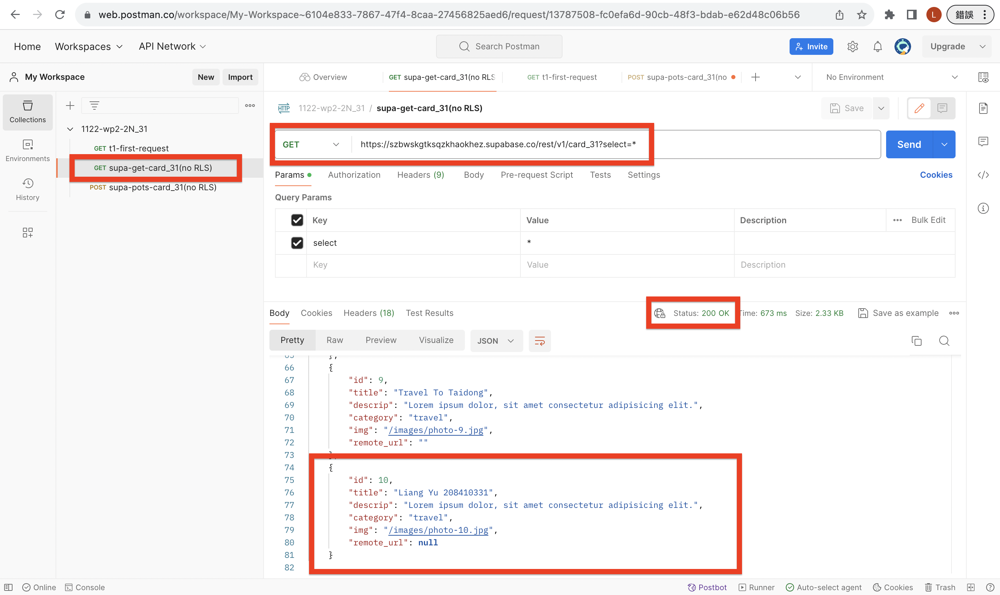

[Github](https://github.com/liangyu9103/1122-wp2-2N_31.git)

### W1-P1: Get Request demo in Postman



```
99ecc61 陳亮瑜  Wed Feb 21 19:22:41 2024 +0800  ### w1-P1: Get Request demo in Postman:
```

### W1-P2: read card_31 table in Supabase



```
39a865f 陳亮瑜  Wed Feb 21 19:52:32 2024 +0800  ### W1-P2 read card_31 table in Supabase:
```

### W1-P3: Create a card into card_31 table in Supabase




### W1-P4:

### W1-P5:

### W1-P6: Git log of W1

```
git log --pretty=format:"%h%x09%an%x09%ad%x09%s" --after="2024-02-20"
```
