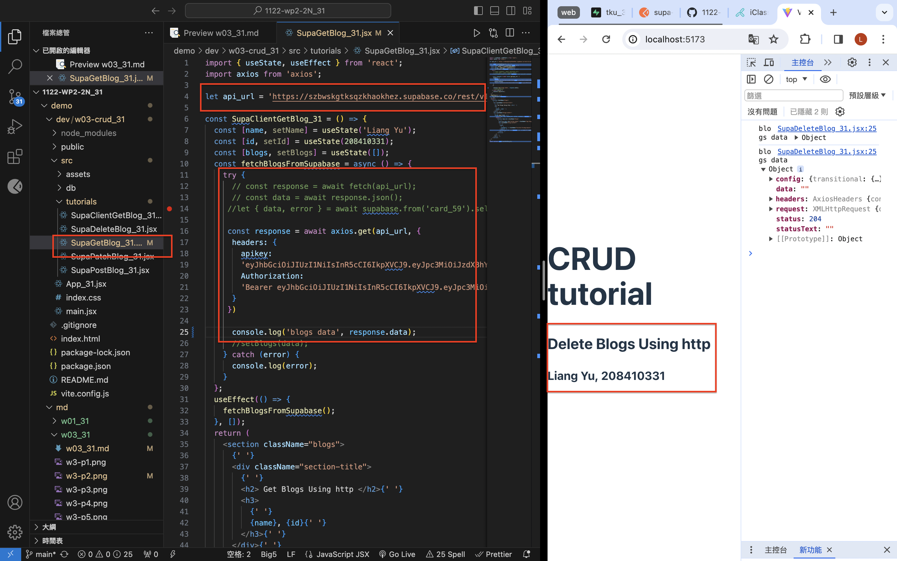

[Github](https://github.com/liangyu9103/1122-wp2-2N_31.git)

### W3-P1: Use SupaClientGetBlog_xx.jsx (supabase client) to get card_xx data


```
ed74f0a 陳亮瑜  Wed Mar 6 20:02:41 2024 +0800   ### W3-P1: Use SupaClientGetBlog_xx.jsx (supabase client) to get card_xx data

```

### W3-P2: Use SupaGetBlog_xx.jsx to get card_xx data



```
48d2ff4 陳亮瑜  Wed Mar 6 20:19:39 2024 +0800   ### W3-P2: Use SupaGetBlog_xx.jsx to get card_xx data
```

### W3-P3: Use SupaPostBlog_xx.jsx to add blog data


```
38d339e 陳亮瑜  Wed Mar 6 20:23:04 2024 +0800   ### W3-P3: Use SupaPostBlog_xx.jsx to add blog data
```

### W1-P6: Git log of W1

```
git log --pretty=format:"%h%x09%an%x09%ad%x09%s" --after="2024-03-01"
```
