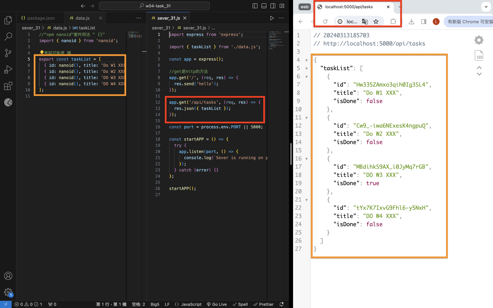
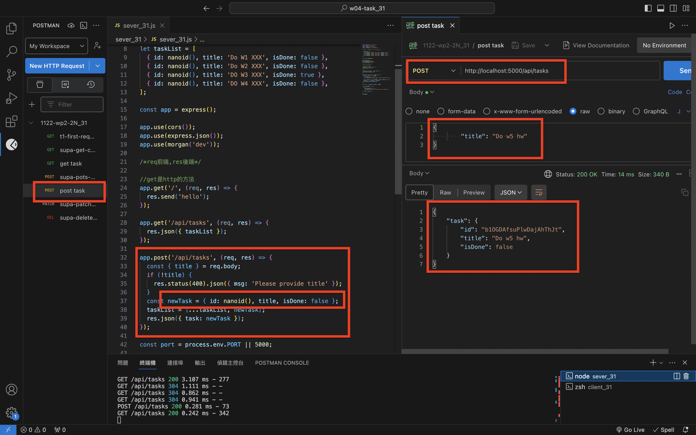

[Github](https://github.com/liangyu9103/1122-wp2-2N_31.git)

### W4-P1: Server: implement GET /api/tasks



```
29edc45 날첝룹  Wed Mar 13 19:10:10 2024 +0800  ### W4-P1: Server: implement GET /api/tasks
```

### W4-P2: Server: implement POST /api/tasks



```
7f7e721 날첝룹  Wed Mar 13 21:06:07 2024 +0800  ### W4-P2: Server: implement POST /api/tasks
```

### W4: Git log of W4

```
git log --pretty=format:"%h%x09%an%x09%ad%x09%s" --after="2024-03-10"

7f7e721 날첝룹  Wed Mar 13 21:06:07 2024 +0800  ### W4-P2: Server: implement POST /api/tasks
29edc45 날첝룹  Wed Mar 13 19:10:10 2024 +0800  ### W4-P1: Server: implement GET /api/tasks
```
