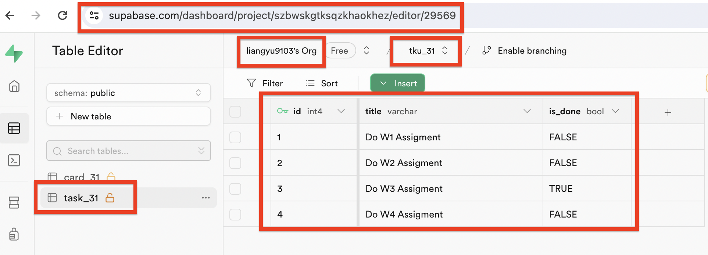
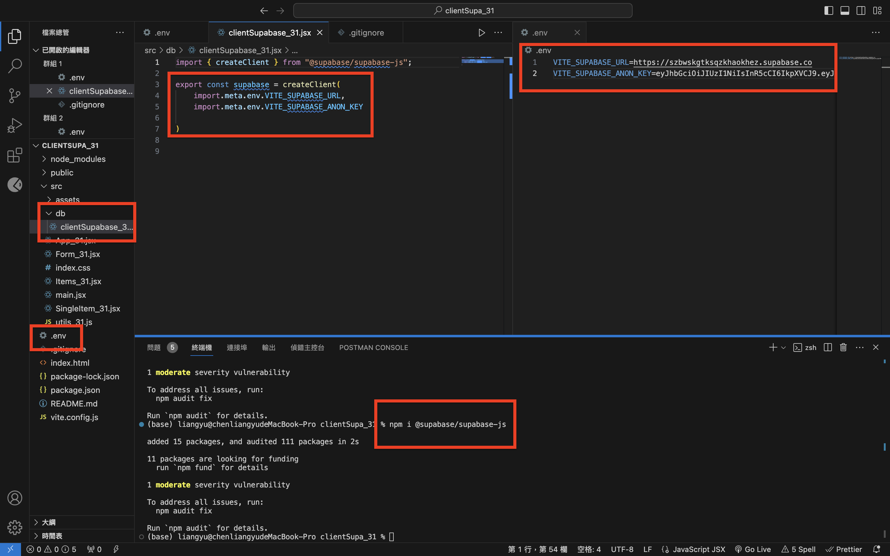
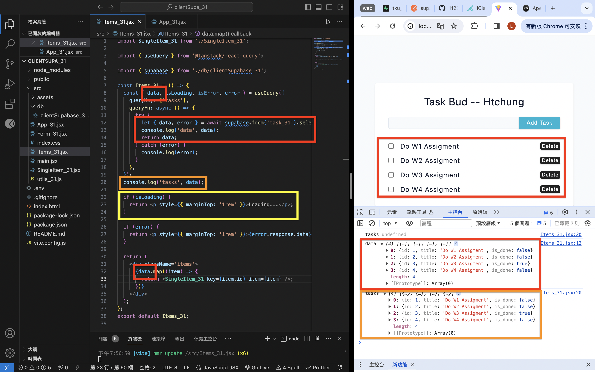
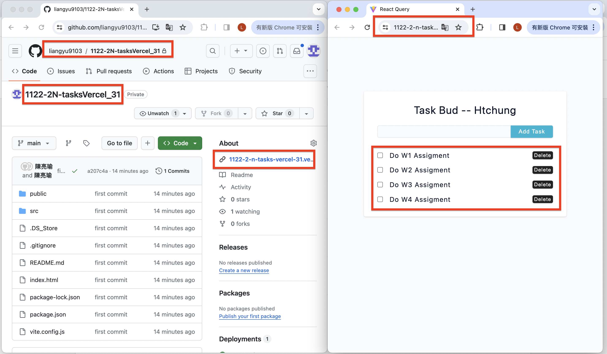
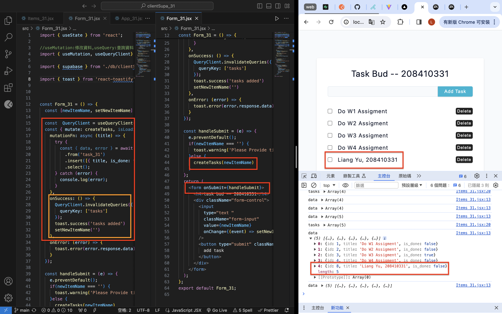
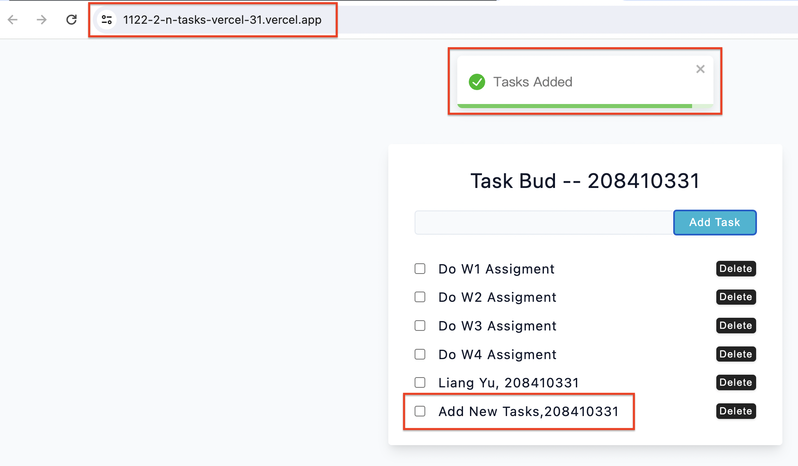

[Github](https://github.com/liangyu9103/1122-wp2-2N_31.git)
[Vercal](https://1122-2-n-tasks-vercel-31.vercel.app/)

### W5-P1: Create task_xx table in Supabase with 4 data using SQL



```
6a783ea 陳亮瑜  Wed Mar 20 18:39:36 2024 +0800  git log --pretty=format:%h%x09%an%x09%ad%x09%s --after=2024-03-18
```

### W5-P2: Use React Query to get tasks data from Supabas





```
8f0c529 陳亮瑜  Wed Mar 20 19:17:25 2024 +0800  ### W5-P2: 設定 supabase client, 使使用 .env
44b2c3e 陳亮瑜  Wed Mar 20 20:08:23 2024 +0800  ### W5-P2: Use React Query to get tasks data from Supabas
```

### W5-P3: Deploy W5-P2 to Vercel



```
6b123a3 陳亮瑜  Wed Mar 20 20:33:39 2024 +0800  ### W5-P3: Deploy W5-P2 to Vercel
```

### W5-P4: Create new Task, deploy W5-P3 to Vercel

#### => local



#### => vercel



### W5: Git log of W5

```
git log --pretty=format:"%h%x09%an%x09%ad%x09%s" --after="2024-03-18"
```
