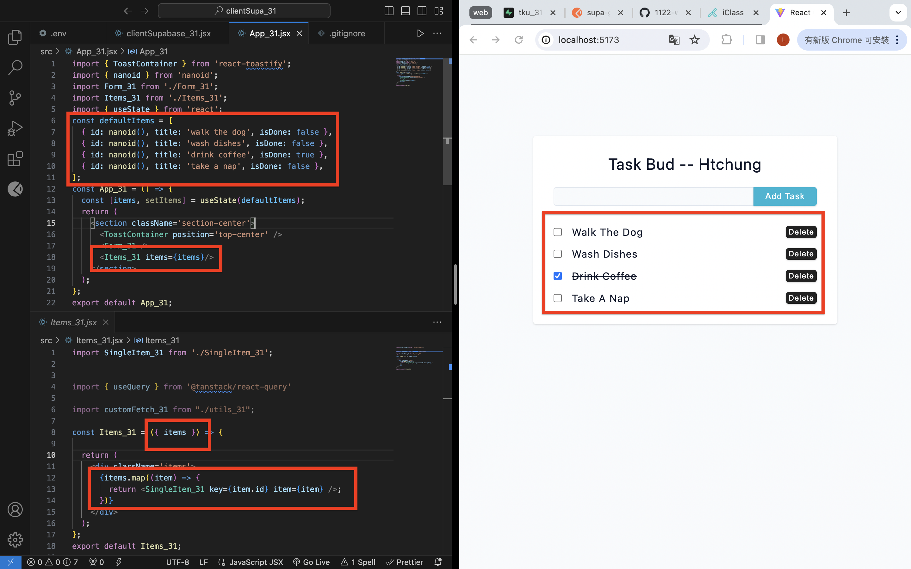

[Github](https://github.com/liangyu9103/1122-wp2-2N_31.git)

### W5-P1: Create task_xx table in Supabase with 4 data using SQL


```
6a783ea 陳亮瑜  Wed Mar 20 18:39:36 2024 +0800  git log --pretty=format:%h%x09%an%x09%ad%x09%s --after=2024-03-18
```

### W5-P2: 設定 supabase client, 使使用 .env




### W5: Git log of W5

```
git log --pretty=format:"%h%x09%an%x09%ad%x09%s" --after="2024-03-18"
```
