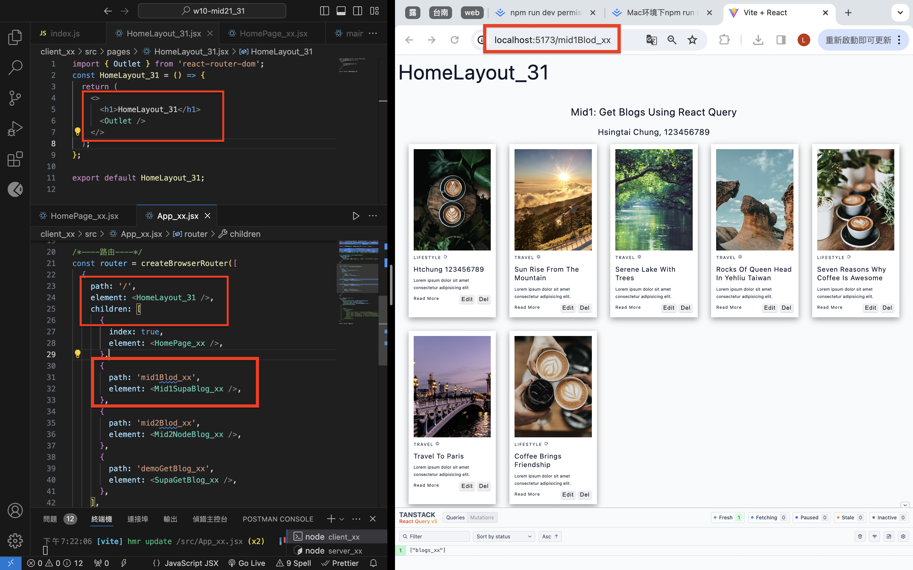

[Github](https://github.com/liangyu9103/1122-wp2-2N_31.git)

### W10-P1: Create HomeLayout_xx for all routes




```
d744164 liangyu9103     Wed Apr 24 19:38:30 2024 +0800  ### W10-P1: Create HomeLayout_xx for all routes
```

### W10-P2: Add Navbar_xx with 3 menu items


```
917b0a9 liangyu9103     Wed Apr 24 21:03:10 2024 +0800  ### W10-P2: Add Navbar_xx with 3 menu items
```

---

### W10-P3: Get all blogs using route /mid1Blog_xx (自行完成)


```
b2f0e11 liangyu9103     Wed Apr 24 21:09:30 2024 +0800  ### W10-P3: Get all blogs using route /mid1Blog_xx
```

### W10-P4: Git logs of W6

```
git log --pretty=format:"%h%x09%an%x09%ad%x09%s" --after="2024-04-22"

fab7062 liangyu9103     Wed Apr 24 21:11:43 2024 +0800  w10 all code
b2f0e11 liangyu9103     Wed Apr 24 21:09:30 2024 +0800  ### W10-P3: Get all blogs using route /mid1Blog_xx
917b0a9 liangyu9103     Wed Apr 24 21:03:10 2024 +0800  ### W10-P2: Add Navbar_xx with 3 menu items
d744164 liangyu9103     Wed Apr 24 19:38:30 2024 +0800  ### W10-P1: Create HomeLayout_xx for all routes
```
