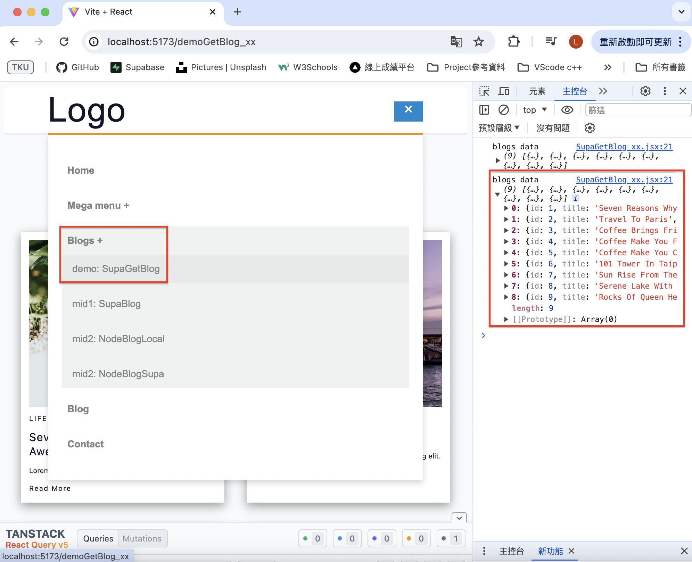
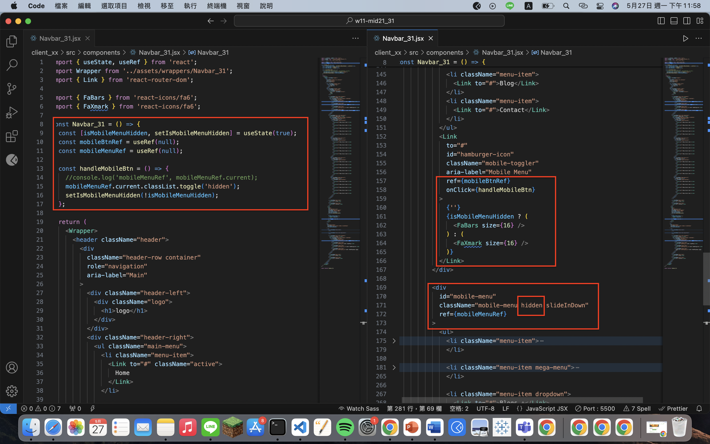
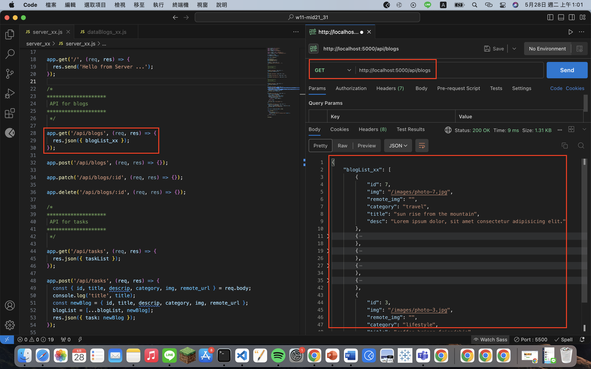
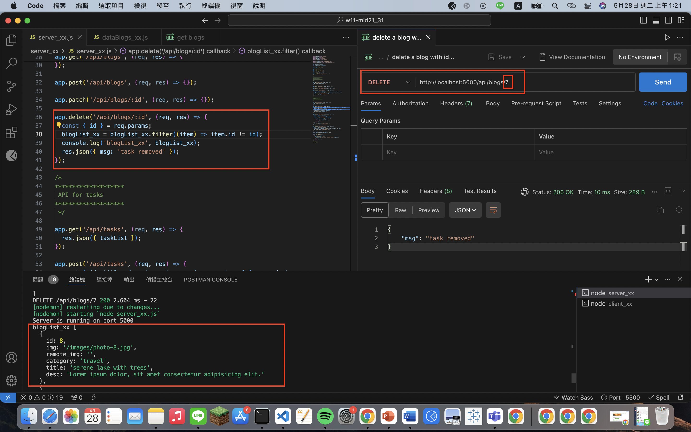
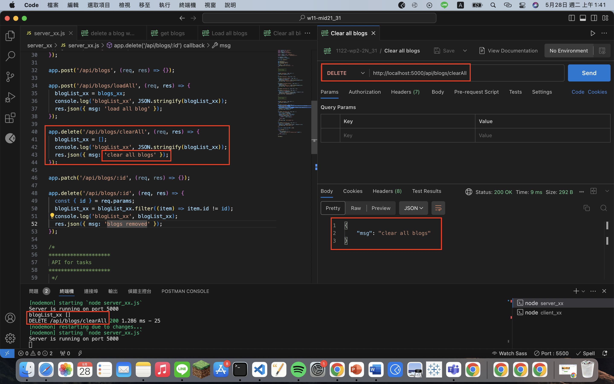
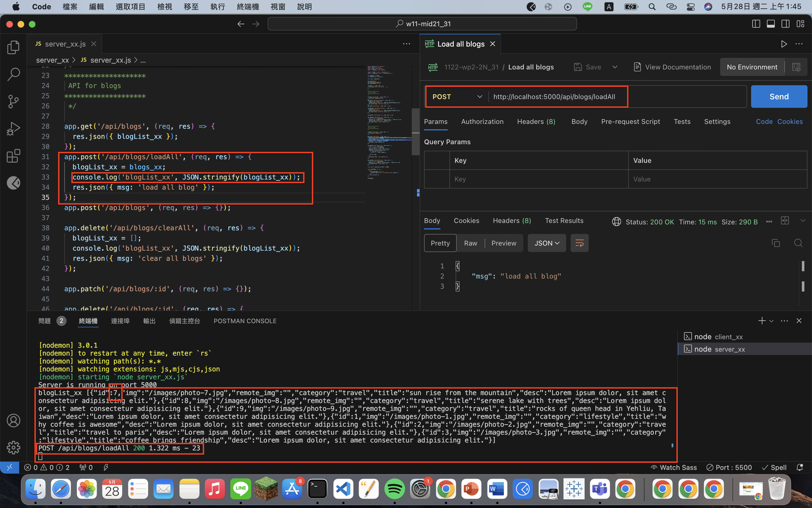

[Github](https://github.com/liangyu9103/1122-wp2-2N_31.git)

### W11-P1: Make mobileBtn work correctly





```
36531e3 liangyu9103     Tue May 28 00:06:34 2024 +0800  ### W11-P1: Make mobileBtn work correctly
```

### W11-P2: Use Postman to test GET /api/blogs, and DELETE /api/blogs/:id





```
96eb9a4 liangyu9103     Tue May 28 01:24:13 2024 +0800  ### W11-P2: Use Postman to test GET /api/blogs, and DELETE /api/blogs/:id
```

### W11-P3: Use Postman to test DELETE /api/blogs/clearAll, and POST /api/blogs/loadAll

#### => test DELETE /api/blogs/clearAll



#### => test POST /api/blogs/loadAll



```
ab76c76 liangyu9103     Tue May 28 01:48:40 2024 +0800  ### W11-P3: Use Postman to test DELETE /api
```

### W11-P4: Git logs of W11 and code

```
git log --pretty=format:"%h%x09%an%x09%ad%x09%s" --after="2024-05-27"
ab76c76 liangyu9103     Tue May 28 01:48:40 2024 +0800  ### W11-P3: Use Postman to test DELETE /api
96eb9a4 liangyu9103     Tue May 28 01:24:13 2024 +0800  ### W11-P2: Use Postman to test GET /api/blogs, and DELETE /api/blogs/:id
36531e3 liangyu9103     Tue May 28 00:06:34 2024 +0800  ### W11-P1: Make mobileBtn work correctly

```
