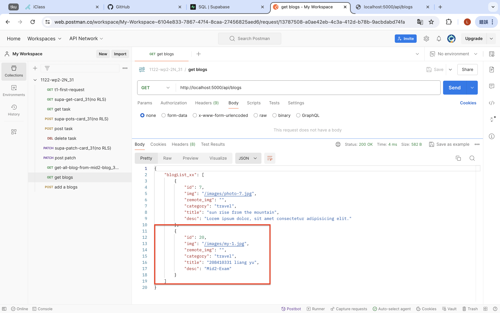
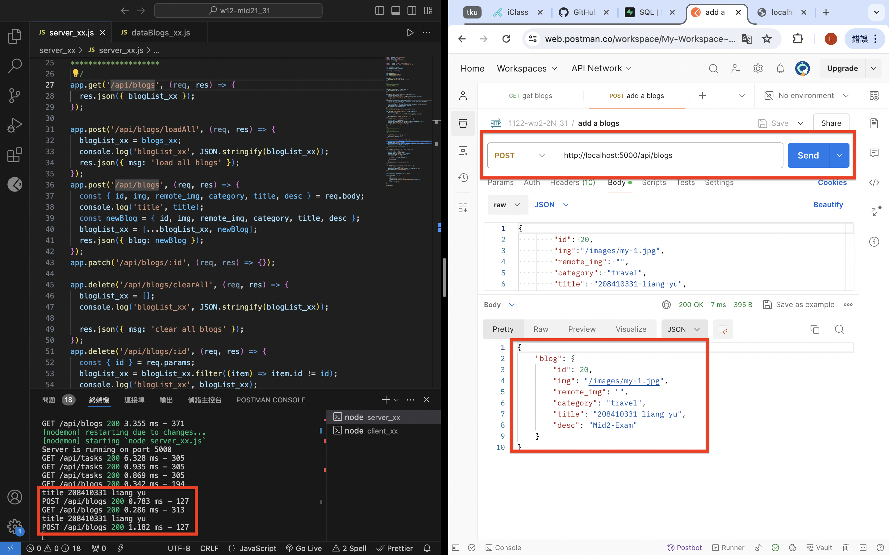
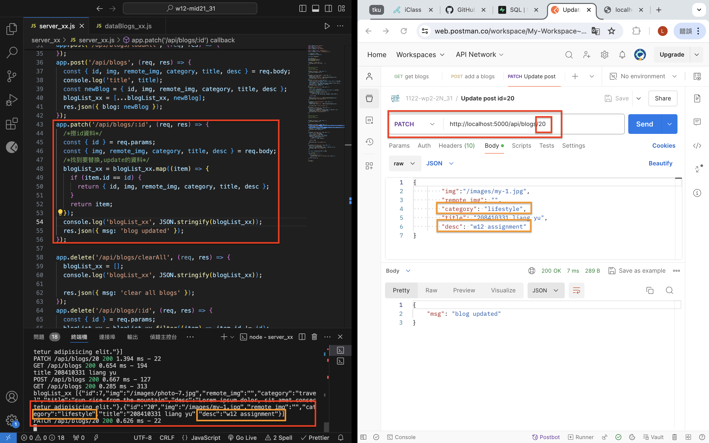
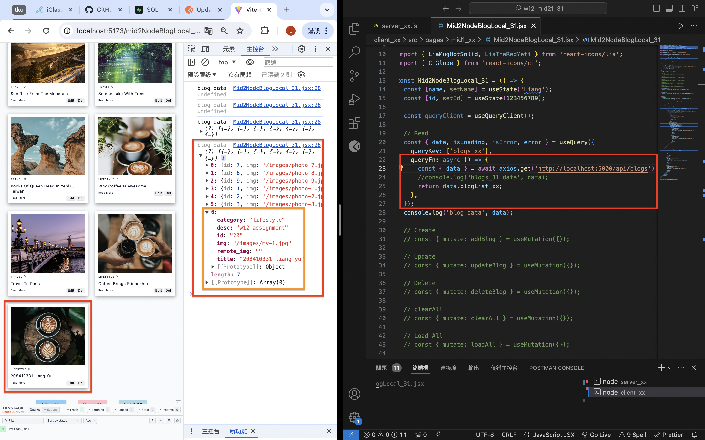
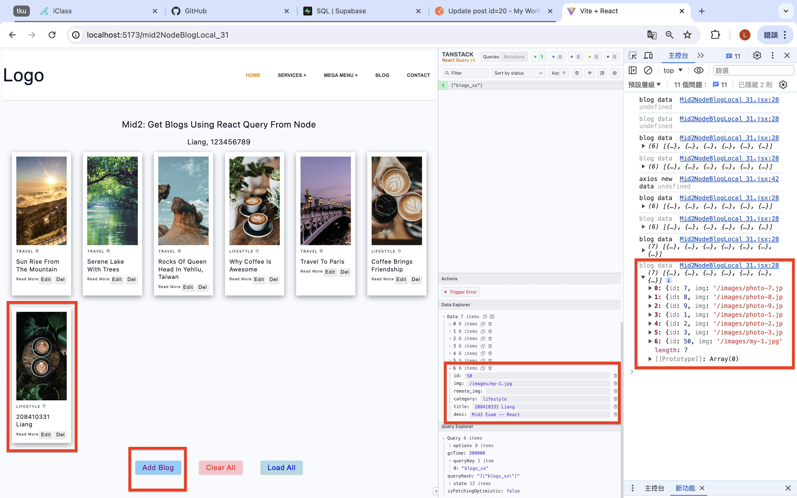
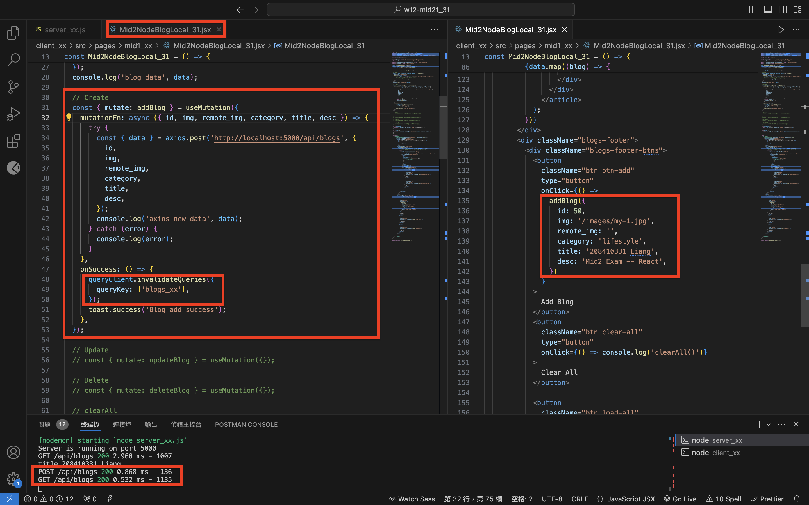

[Github](https://github.com/liangyu9103/1122-wp2-2N_31.git)

### W12-P1: Insert a blog using local json array




```
f7bd345 liangyu9103     Wed May 8 19:53:25 2024 +0800   ### W12-P1: Insert a blog using local json array
```

### W12-P2: Update a blog with id=20



```
da24083 liangyu9103     Wed May 8 20:27:57 2024 +0800   ### W12-P2: Update a blog with id=20
```

### W12-P3: Use React Query to read all blogs from Node server



```
66a2272 liangyu9103     Wed May 8 21:01:12 2024 +0800   ### W12-P3: Use React Query to read all blogs from Node server
```

### W12-P4: Insert a blog using React Query




```
9a67b3a liangyu9103     Wed May 8 21:23:30 2024 +0800   ### W12-P4: Insert a blog using React Query
```

### W12-P5: Git logs of W12

```
git log --pretty=format:"%h%x09%an%x09%ad%x09%s" --after="2024-05-05"
9a67b3a liangyu9103     Wed May 8 21:23:30 2024 +0800   ### W12-P4: Insert a blog using React Query
66a2272 liangyu9103     Wed May 8 21:01:12 2024 +0800   ### W12-P3: Use React Query to read all blogs from Node server
da24083 liangyu9103     Wed May 8 20:27:57 2024 +0800   ### W12-P2: Update a blog with id=20
f7bd345 liangyu9103     Wed May 8 19:53:25 2024 +0800   ### W12-P1: Insert a blog using local json array
```
