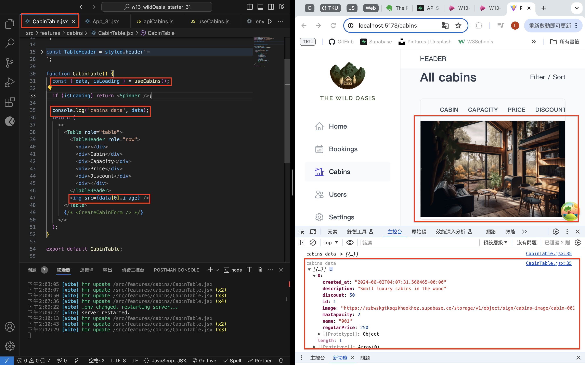
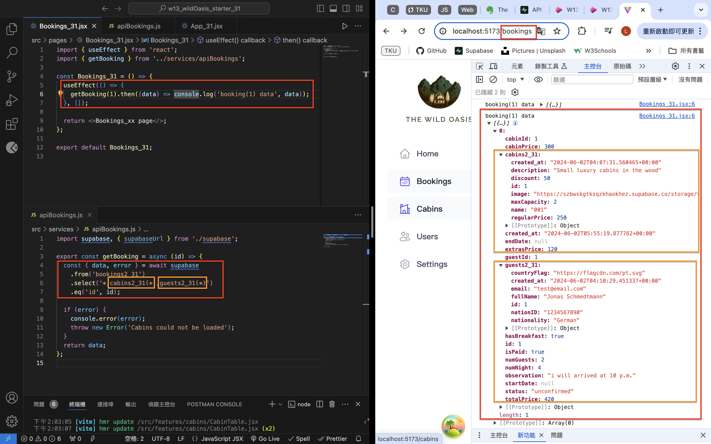

[Github](https://github.com/liangyu9103/1122-wp2-2N_31.git)

### W13-P1: Get first Cabins_xx data from Supabase



```
e04989d liangyu9103     Sun Jun 2 14:18:46 2024 +0800   ### W13-P1: Get first Cabins_xx data from Supabase
```

### W13-P2: Get first booking_xx data, with corresponding cabin_xx and guest_xx data



```
f28b4fa liangyu9103     Sun Jun 2 14:35:55 2024 +0800   ### W13-P2: Get first booking_xx data, with corresponding cabin_xx and guest_xx data
```

### W13: log and all code

```
git log --pretty=format:"%h%x09%an%x09%ad%x09%s" --after="2024-06-01"

f28b4fa liangyu9103     Sun Jun 2 14:35:55 2024 +0800   ### W13-P2: Get first booking_xx data, with corresponding cabin_xx and guest_xx data
e04989d liangyu9103     Sun Jun 2 14:18:46 2024 +0800   ### W13-P1: Get first Cabins_xx data from Supabase

```
